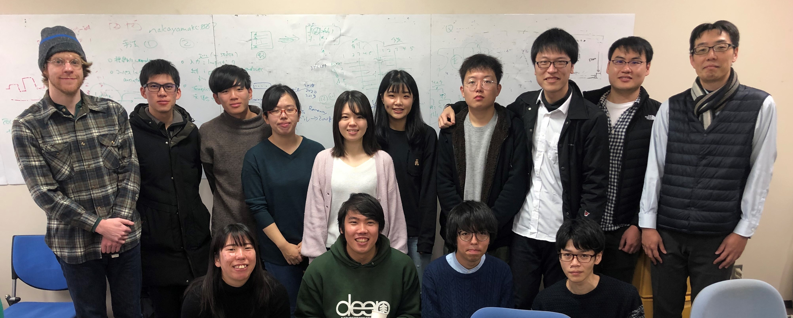

# 研究室について

筑波大学上保研究室は2009年に設立され、それ以来情報検索や情報探索行動を中心とした人間情報インタラクションに関する多様な研究を精力的に行っています。

上保研究室は国際的なラボであり、これまで米国、アイルランド、ドイツ、チュニジア、バングラデシュ、イラン、インドネシア、中国から客員教員、交換留学生、正規留学生を受け入れています。また、世界中の一流研究者との共同研究も多く行っています。

我々は、情報検索などの人間と情報のインタラクションに関心のある学生を広く募集しています。もし情報学（コンピュータサイエンスや図書館情報学など）などのバックグラウンドをお持ちの方で、研究室への配属を検討されている方おりましたら、お気軽にお問い合わせください。







